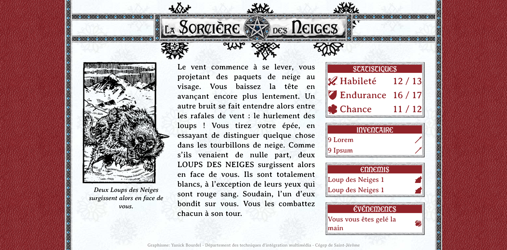

# Exercice Sorcière

> ATTENTION! Visionner ce document avec 'Open Preview' dans VSCode

## Objectif
1. Récupérer les données d'une variable contenant une structure de données complexe.
2. Placer ces données au bons endroits dans la page.

## Étapes

### Étape 1. Récupérer les données

À l'aide des données contenues dans le fichier `histoire.js`, et chargées dane la variable `histoire` vous devez afficher les informations suivantes dans la console :

> Les numéros de lignes sont donnés à titre indicatif. La première commande vous est donnée en exemple.

| Affichage                                                              | Ligne        |
| ---------------------------------------------------------------------- | ------------ |
| Le vent commence à se lever, vous projetant des paquets de neige [...] | App.js:5:17  |
| Object { url: "images/figures/212.png", largeur: 263, [...] }          | App.js:6:17  |
| images/figures/212.png                                                 | App.js:7:17  |
| Deux Loups des Neiges surgissent alors en face de vous.                | App.js:8:17  |
| 12                                                                     | App.js:9:17  |
| 13                                                                     | App.js:10:17 |
| 16                                                                     | App.js:11:17 |
| 17                                                                     | App.js:12:17 |
| 11                                                                     | App.js:13:17 |
| 12                                                                     | App.js:14:17 |
| 10                                                                     | App.js:15:17 |
| Provisions (repas)                                                     | App.js:16:17 |
| images/objet_provisions.svg                                            | App.js:17:17 |
| 1                                                                      | App.js:18:17 |
| Masse d'arme                                                           | App.js:19:17 |
| images/objet_masse.svg                                                 | App.js:20:17 |
| Loup des Neiges 1                                                      | App.js:21:17 |
| images/ennemi_loup.svg                                                 | App.js:22:17 |
| Loup des Neiges 2                                                      | App.js:23:17 |
| images/ennemi_loup.svg                                                 | App.js:24:17 |
| Vous vous êtes gelé la main                                            | App.js:25:17 |
| images/evenement_gelee.svg                                             | App.js:26:17 |

### 2. Trouver les sélecteurs

En regardant la structure du fichier `index.html`, vous devez trouver les sélecteurs qui vous permettront de modifier toutes les couleurs de bordures pour du `green`.

> La première commande vous est donnée en exemple.
> 
> Vous pouvez utiliser des boucles pour parcourir les éléments.

### 3. Placer les données

Utiliser les données récupérées à l'étape 1 pour les placer aux endroits identifiés à l'étape 2.

### 4. Nettoyage

Modifier le code de l'étape 2 pour tout simplement supprimer les bordures des éléments à l'aide de `...border = 'none'`.

Nettoyer le code en retirant les `console.log` inutiles.